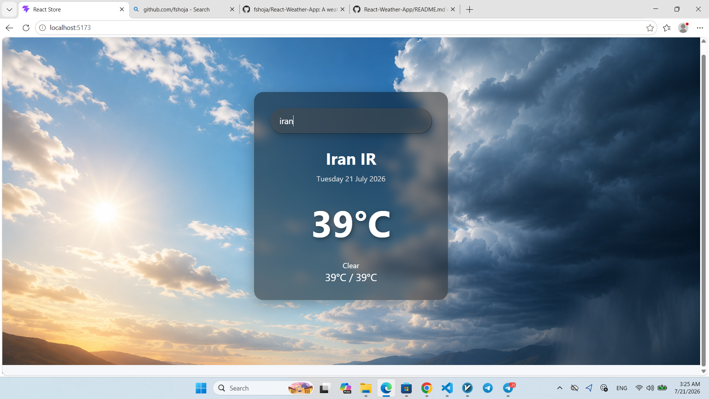

# 🌦️ React Weather App

A modern weather application built with React and OpenWeather API. Search for any city and view real-time weather information.

## 📸 Screenshot



## 🔗 GitHub Repository

https://github.com/fshoja/React-Weather-App

## ✨ Features

- Search weather by city
- Real-time weather information
- Current temperature
- Min & Max temperature
- Weather condition
- Responsive design

## 🛠️ Technologies

- React
- JavaScript (ES6+)
- CSS
- OpenWeather API

## 📦 Installation

```bash
npm install
npm run dev
```

## 👨‍💻 Author

**F Shoja**